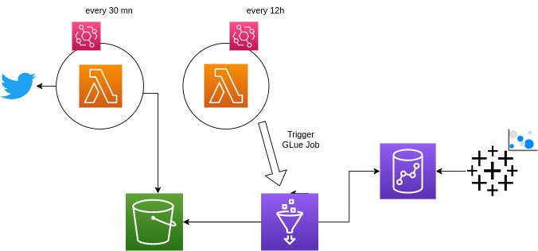

# Cryptotweets

Cryptotweets is a data pipeline fully built on AWS that ingest twitter data related to cryptocurrencies and perform some analysis

## I- How it works



1- Cryptotweets works by pulling twitter data using the twitter streaming API. Tweets are ingested with a lambda function made in python and are stored in an S3 bucket

2- Then there is another lambda function which role is to trigger a spark Glue job that aggregates data stored in S3 and save the result in a Redshift table.

3- A dashboard built on Tableau is plugged to the Redshift table and show some visualisations

4- Amazon EventBridge is used to trigger the lambda functions.


## II- Installation

We worked on the reusability of Cryptotweets using Terraform. Terraform is a configuration management tool that allows us to describe infrastructure in a abstract way and create it in a reproducible manner. This helped us to improved the quality of our project by making it easier to maintain and evolve.

Follow these steps in order to setup Cryptotweets:

### - Clone the project
```bash
git clone https://github.com/williamsiewe16/Cryptotweets
```

### - Install terraform if you don't have it yet

```bash
sudo apt-get update && sudo apt-get install -y gnupg software-properties-common

wget -O- https://apt.releases.hashicorp.com/gpg | \
    gpg --dearmor | \
    sudo tee /usr/share/keyrings/hashicorp-archive-keyring.gpg

gpg --no-default-keyring \
    --keyring /usr/share/keyrings/hashicorp-archive-keyring.gpg \
    --fingerprint

echo "deb [signed-by=/usr/share/keyrings/hashicorp-archive-keyring.gpg] \
    https://apt.releases.hashicorp.com $(lsb_release -cs) main" | \
    sudo tee /etc/apt/sources.list.d/hashicorp.list

sudo apt update

sudo apt-get install terraform
```

### - Install python dependencies for the twitter lambda function into a specific folder

This folder will be used to build a lambda layer that will be added to the lambda function

```bash
pip install -r ../lambda/cryptotweets_twitter_scraper/requirements.txt -t ../lambda/tmp/python
```

### - Fill the env file with your configurations

There is a file called env.tfvars in the project. This is a configuration file that will be used by terraform. You have to fill it with at least your aws credentials (access key and secret) and your twitter api credentials

### Setup the pipeline on AWS
```bash
cd deployment/
terraform plan --var-file="../env.tfvars"
terraform apply -auto-approve --var-file="../env.tfvars"
```